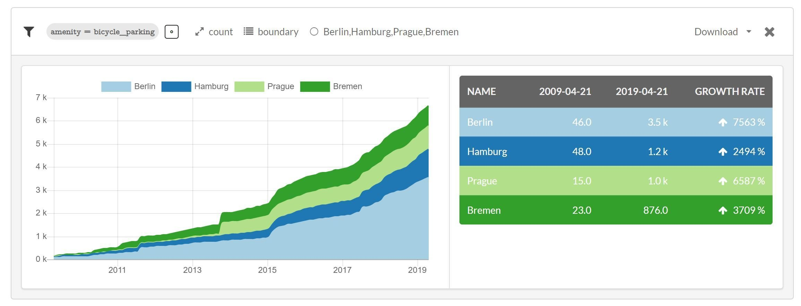
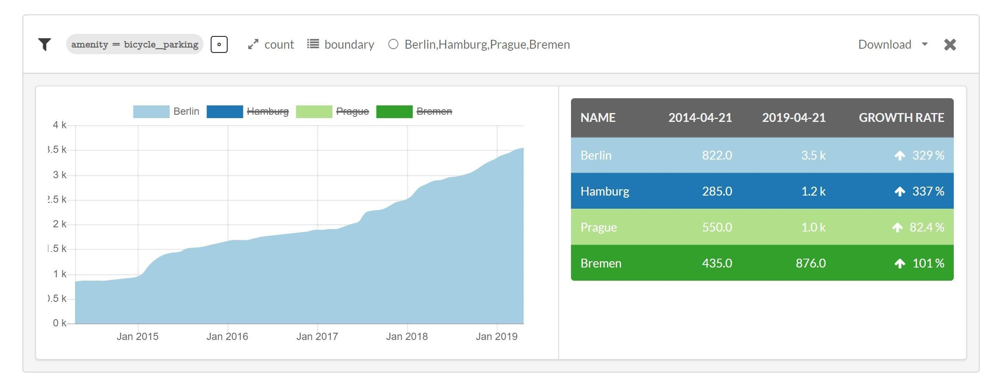
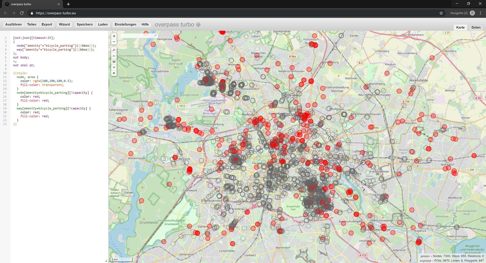

# Fahrradstellplätze Berlin
Experimental single purpose editor for bike parking in Berlin http://wwwfiles.de/fahrradstellplaetze/, based on discussions in the [Berlin OpenStreetMap meetup](https://wiki.openstreetmap.org/wiki/Talk:Berlin/Verkehrswende/Fahrradparkplaetze).
Seeded and developed during the [DB Open-Data-Hackathon Summercamp 2019](https://dbmindbox.com/en/db-opendata-hackathons/hackathons/db-open-data-hackathon-community-summercamp-juli-2019/).

*Note: The code for this project can be found over at [@tordans fork](https://github.com/tordans/id) of the official [iD OpenStreetMap editor](https://github.com/openstreetmap/id).*

## Single Purpose Editors

Several topics out of the OpenStreetMap ecosystem have massively grown in complexity and hence became harder and harder to map, especially for the casual mapper or even mapping beginners in order to bring domain soecific knowledge in public databases like OpenStreetMap. To test the waters for a more focused mapping we tried to implement a single purpose editor. After trying different editors or even writing a completely new interface we opted for altering the web editor of OpenStreetMap - iD. As a result we compiled a list of GitHub issues to possible improve single-porpuse editors like this one in the future.

## `data/`

We compiled a few snapshots of the current state of mapping bike infrastructure in [Berlin](https://wikidata.org/wiki/Q64) in our [presentation](https://slides.com/n0rdlicht/deck#/), also to be found in `presentation/`. Nodes and ways for `amenity=bicycle_parking`

With some ohsome and wikidata magic Berlin actually fairs well among other german city states in relation to it's area. Compared to it's inhabtitants though it comes in second to Bremen.

| State | Stellplatz April 2019 (ohmsome) | Area [km2] (wd:P2046) | Gemappte Stellplätze / km2 | Einwohner (wd:P1082) | Gemappte Stellplätze / 1000 Einwohner |
| ----- | ---------- | ----- | ---- | ---- | --- |
| Berlin | 3506 | 891.68 | **3.93** | 3.613.495 | 0.97 |
| Hamburg | 1202 | 755.09 | 1.59 | 1.830.584 | 0.66 |
| Prague | 1000 | 496.21 | 2.02 | 1.294.513 | 0.77 |
| Bremen | 874 | 317.88 | 2.75 | 568.006 | **1.54** |

From the same data here's the historical development from 2009 onwards (`data/ohsome-berlin-bike-stands-history.csv` includes more years):

And lastly the trend for Berlin of the recent 5 years:

### Completness Mapping via Overpass

Besides a growing dataset data quality becomes of utmost importance. So we did a quick check on two OSM tags being present via Overpass. In `red` are the incomplete nodes, `grey` the complete ones.

## Team

- Tobias Jordans ([@tordans](https://twitter.com/tordans))
- Thorben Westerhuys ([@twesterhuys](https://twitter.com/twesterhuys))

## License

This repository is made available by its maintainers under the Public Domain Dedication and License v1.0, a copy of the full text of which is in LICENSE.md. Forks, contributions and feedback are welcomed.
